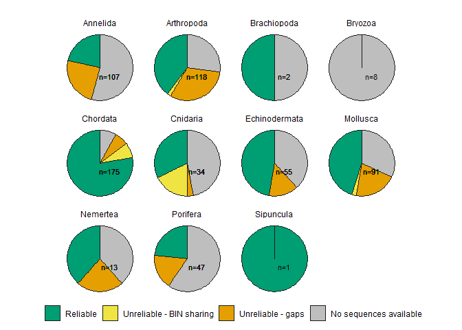
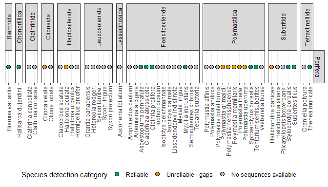
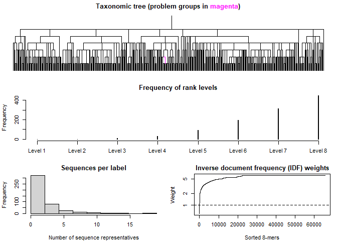

GSL-rl : Gulf of St. Lawrence reference library
================

Reference sequences for marine species assignments in the Gulf of
St. Lawrence, at the COI loci.

**Currrent version : 1.0**  
Check [this
page](https://github.com/GenomicsMLI-DFO/MLI_GSL-rl/releases) for
previous versions of GSL-rl.

**Main maintainer:** Audrey Bourret  
**Affiliation:** Fisheries and Oceans Canada (DFO)  
**Group:** Laboratory of genomics  
**Location:** Maurice Lamontagne Institute  
**Affiliated publication:** [Maximizing the reliability and the number
of species assignments in metabarcoding studies
(2022)](https://www.biorxiv.org/content/10.1101/2022.11.17.513905v1).
Bourret, A., Nozères, C., Parent, É., Parent, G.J. bioRxiv
2022.11.17.513905; doi: <https://doi.org/10.1101/2022.11.17.513905>  
**Contact:** <audrey.bourret@dfo-mpo.gc.ca>

-   [Description of GSL-rl](#description-of-gsl-rl)
-   [Status](#status)
-   [Contents](#contents)
    -   [Folder structure](#folder-structure)
    -   [GSL-rl COI](#gsl-rl-coi)
-   [Assignment examples](#assignment-examples)
-   [Caveats](#caveats)
-   [Acknowledgements](#acknowledgements)
-   [References](#references)

## Description of the GSL-rl

GSL-rl is a collection of curated and annotated sequences for performing
genetic assignments using COI barcodes for marine fauna in the Gulf of
St. Lawrence. It actually covered 651 targeted species, and sequences
are currently available for **439 species**.

<!-- -->

The initial list of species is based on a published checklist based on 4
sources [(Nozères 2017)](https://doi.org/10.13140/rg.2.2.10056.62727)
and comprised more than 2000 marine species potentially present within
the Gulf of St. Lawrence. The ultimate goal of GSL-rl is to coverall
these species in the future.

## Status

“Ongoing-improvements”

## Contents

### Folder structure

    .
    ├── GSL-rl_COI     # Main folder containing reference sequences for COI 
    ├── Examples       # Example datasets 
    └── README.md

### GSL-rl COI

Two fasta files are available, one for the full fragment (\~650 pb;
Folmer) and another one cut to fit common smaller metabarcoding region
(\~313 pb; Leray). The smaller fragment is also composed of less
sequences because exact duplicated sequences were removed.

-   [GSL-rl\_COI\_Folmer650pb\_450taxa\_1304seq.fasta](GSL-rl_COI/GSL-rl_COI_Folmer650pb_450taxa_1304seq.fasta)  
-   [GSL-rl\_COI\_Leray313pb\_450taxa\_1040seq.fasta](GSL-rl_COI/GSL-rl_COI_Leray313pb_450taxa_1040seq)

``` r
DNA.folmer <- Biostrings::readDNAStringSet("GSL-rl_COI/GSL-rl_COI_Folmer650pb_450taxa_1304seq.fasta")
DNA.folmer
```

    ## DNAStringSet object of length 1304:
    ##        width seq                                            names               
    ##    [1]   640 TGGATCGTTTGCTGCAATGGTA...ATTCTTTATCAACATTTATTT GBCI4815-14_Root_...
    ##    [2]   640 TGGATTGTTTGCTGCAATGGTA...ATTCTTTATCAACATTTATTT GBCI4819-14_Root_...
    ##    [3]   640 CGGATTGTATGCTGCAATGGTA...ATTCTTTATCAACATTTATTT GBCI4816-14_Root_...
    ##    [4]   640 TGGATTGTATGCTGCAATGGTA...ATTCTTTATCAACATTTATTT GBCI4820-14_Root_...
    ##    [5]   640 TGGATTGTTTGCTGCAATGGTA...ATTCTTTATCAACATTTATTT GBCI4817-14_Root_...
    ##    ...   ... ...
    ## [1300]   661 GACTCTTTATCTATATAGTGGG...GTCTTGTTTCAACATTTGTTC DESS022-20_Root_A...
    ## [1301]   661 GACTCTTTATCTATATAGTGGG...GTCTTGTTTCAACATTTGTTC STAN008-14_Root_A...
    ## [1302]   661 GACTCTTTATCTATATAGTGGG...GTCTTGTTTCAACATTTGTTC DESS018-20_Root_A...
    ## [1303]   658 AACCCTTTATCTGTATAGCGGA...CCCGTTTTGTTCCAACATTTG ECMOL120-11_Root_...
    ## [1304]   657 ACTCTTTACCTTTATAGAGGGG...CCTGTTCTGTTTCAACATTTA SERCI583-14_Root_...

Sequence name follows this nomenclature: *BOLD/NCBI Unique ID* \_ Root
\_ *Kingdom* \_ *Phylum* \_ *Class* \_ *Order* \_ *Family* \_ *Genus* \_
*Species*

``` r
names(DNA.folmer)[c(1, 10, 100)]
```

    ## [1] "GBCI4815-14_Root_Animalia_Cnidaria_Hydrozoa_Siphonophorae_Agalmatidae_Nanomia_Nanomia_cara"   
    ## [2] "BBPS066-19_Root_Animalia_Annelida_Polychaeta_Spionida_Spionidae_Laonice_Laonice_cirrata"      
    ## [3] "GBCM20402-19_Root_Animalia_Arthropoda_Hexanauplia_Calanoida_Temoridae_Temora_Temora_stylifera"

Metadata included the species rank category, that can be retrieve
easily.

``` r
metadata   <- readr::read_csv("GSL-rl_COI/GSL-rl_COI_metadata.csv")

metadata %>% dplyr::filter(str_detect(Name, "Ammodytes")) %>% dplyr::select(Name, SEQavailable, BIN, SPsharingBIN, Validity) 
```

    ## # A tibble: 3 x 5
    ##   Name                 SEQavailable BIN          SPsharingBIN     Validity      
    ##   <chr>                <chr>        <chr>        <chr>            <chr>         
    ## 1 Ammodytes americanus Yes          BOLD:AAB4332 Ammodytes dubius Unreliable - ~
    ## 2 Ammodytes dubius     Yes          BOLD:AAB4332 Ammodytes ameri~ Unreliable - ~
    ## 3 Ammodytes hexapterus Yes          BOLD:AAB8000 <NA>             Reliable

``` r
metadata %>% dplyr::filter(family == "Asteriidae") %>% dplyr::select(Name, SEQavailable, BIN, SPsharingBIN, SPmissingSEQ.genus, Validity) 
```

    ## # A tibble: 9 x 6
    ##   Name       SEQavailable BIN        SPsharingBIN    SPmissingSEQ.ge~ Validity  
    ##   <chr>      <chr>        <chr>      <chr>           <chr>            <chr>     
    ## 1 Asterias ~ Yes          BOLD:AAB6~ <NA>            <NA>             Reliable  
    ## 2 Asterias ~ Yes          BOLD:AAB8~ <NA>            <NA>             Reliable  
    ## 3 Leptaster~ Yes          BOLD:AAB2~ Leptasterias l~ Leptasterias te~ Unreliabl~
    ## 4 Leptaster~ Yes          BOLD:AAB2~ Leptasterias g~ Leptasterias te~ Unreliabl~
    ## 5 Leptaster~ Yes          BOLD:AAJ1~ <NA>            Leptasterias te~ Unreliabl~
    ## 6 Leptaster~ Yes          BOLD:ACE6~ <NA>            Leptasterias te~ Unreliabl~
    ## 7 Leptaster~ No           <NA>       <NA>            <NA>             No sequen~
    ## 8 Stephanas~ Yes          BOLD:AAF3~ <NA>            <NA>             Reliable  
    ## 9 Urasteria~ Yes          BOLD:AAF5~ <NA>            <NA>             Reliable

The species rank category can be explore and add as a layer of
information on metabarcoding results.

<!-- -->

## Assignment examples

### ID-taxa

**Step 1 :** Create a training set out of GSL-rl.

``` r
library(DECIPHER)

# TaxID : Training the classifier -------------------------------------------------

# train the classifier

set.seed(111) # to get the same result everytimes

DNA.leray <- Biostrings::readDNAStringSet("GSL-rl_COI/GSL-rl_COI_Leray313pb_450taxa_1040seq.fasta")
DNA.leray
```

    ## DNAStringSet object of length 1040:
    ##        width seq                                            names               
    ##    [1]   314 CATTATCTGGACCTCAAGCACA...ATTCTTTATCAACATTTATTT GBCI4815-14 Root;...
    ##    [2]   314 CATTATCTGGACCTCAAGCACA...ATTCTTTATCAACATTTATTT GBCI4816-14 Root;...
    ##    [3]   314 CATTATCTGGACCTCAAGCACA...ATTCTTTATCAACATTTATTT GBCI4817-14 Root;...
    ##    [4]   314 CCCTCGCAGCTAATATTGCCCA...ATCCTATACATACACCTATTT BBPS065-19 Root; ...
    ##    [5]   314 CCCTCGCAGCTAATATTGCCCA...ATCCTATACATACACCTATTT BBPS1055-19 Root;...
    ##    ...   ... ...
    ## [1036]   313 TCTGTCTTCTGTGGAGTATCAT...GTTTTGTTTCAACATGTTTTT ARCMI292-14 Root;...
    ## [1037]   313 ATTGTCTGTATACCCTTATCAT...GTCTTGTTTCAACATTTGTTC DESS022-20 Root; ...
    ## [1038]   313 ATTGTCTGTATATCCTTATCAT...GTCTTGTTTCAACATTTGTTC DESS018-20 Root; ...
    ## [1039]   310 TTTATCTGTGTACCCCTATCAT...CCCGTTTTGTTCCAACATTTG ECMOL120-11 Root;...
    ## [1040]   310 ACTATCCAGGTACCCGTACCAT...CCTGTTCTGTTTCAACATTTA SERCI583-14 Root;...

``` r
trainingSet.leray <- DECIPHER::LearnTaxa(DNA.leray,
                                         names(DNA.leray)
                                         )
```

    ## ================================================================================
    ## 
    ## Time difference of 9.33 secs

``` r
set.seed(NULL)

# This group is already known as being problemation
trainingSet.leray$problemGroups
```

    ## [1] "Root;Animalia;Mollusca;Gastropoda;Neogastropoda;Buccinidae;Buccinum;"

``` r
# If there is problematic sequences, we should do something

plot(trainingSet.leray)
```

<!-- -->

**Step 2 :** Performed genetic assignments.

``` r
ASV <- readDNAStringSet(filepath = "./Examples/ASV_example_leray.fasta")
names(ASV) 
```

    ##  [1] "ASV_1"  "ASV_2"  "ASV_3"  "ASV_4"  "ASV_5"  "ASV_6"  "ASV_7"  "ASV_8" 
    ##  [9] "ASV_9"  "ASV_10"

``` r
# Remove gaps
ASV <- RemoveGaps(ASV,
             removeGaps = "all",
             processors = 1)


# Very high confidence
ids.60 <- DECIPHER::IdTaxa(ASV,
              trainingSet.leray,
              type="extended",
              strand="top",
              bootstraps = 100,
              threshold=60,
              processors=1)
```

    ## ================================================================================
    ## 
    ## Time difference of 0.08 secs

``` r
ids.60
```

    ##   A test set of class 'Taxa' with length 10
    ##      confidence name                 taxon
    ##  [1]        20% ASV_1                Root; unclassified_Root...                 
    ##  [2]        19% ASV_2                Root; unclassified_Root...                 
    ##  [3]        22% ASV_3                Root; unclassified_Root...                 
    ##  [4]        20% ASV_4                Root; unclassified_Root...                 
    ##  [5]        21% ASV_5                Root; unclassified_Root...                 
    ##  [6]        22% ASV_6                Root; unclassified_Root...                 
    ##  [7]        25% ASV_7                Root; unclassified_Root...                 
    ##  [8]        97% ASV_8                Root; Animalia; Arthropoda; Hexanauplia;...
    ##  [9]        23% ASV_9                Root; unclassified_Root...                 
    ## [10]        22% ASV_10               Root; unclassified_Root...

## Caveats

Like any other reference library, this one is not perfect. Users should
consider these aspects in their interpretation of their results when
using GSL-rl:

-   It covers species from the Gulf St. Lawrence
-   It covers only a small fraction of marine diversity within the GSL
-   Ranking category could change for better or even worst over times
-   Always considere a comparison of species assignemnts with another
    reference library

## Acknowledgements

Grégoire Cortial and Jade Larivière for their inputs while developing
the GSL-rl.

## References

Murali A, Bhargava A, Wright ES (2018) IDTAXA: a novel approach for
accurate taxonomic classification of microbiome sequences. Microbiome 6:
140. <https://doi.org/10.1186/s40168-018-0521-5>

Nozères C (2017) Preliminary checklist of marine animal species of the
Gulf of St. Lawrence, Canada, based on 4 sources.
<https://doi.org/10.13140/RG.2.2.10056.62727>

Wright ES (2016) Using DECIPHER v2.0 to analyze big biological sequence
data in R. R Journal 8: 352–359. <https://doi.org/10.32614/rj-2016-025>
